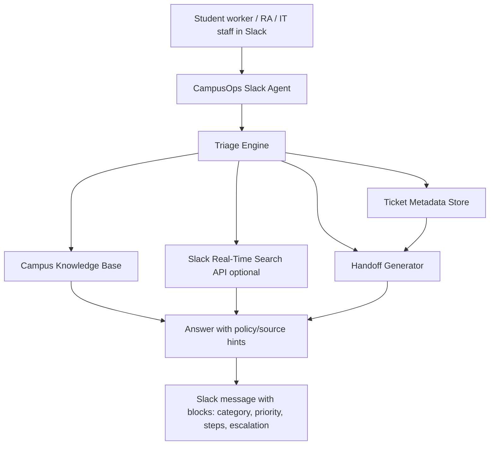

# CampusOps Agent architecture

## Components

### Slack surface
CampusOps lives where student workers already coordinate: Slack DMs, app mentions, slash command, and eventually App Home.

### Triage engine
Classifies requests into:
- IT account access
- IT printing
- Residence Life/facilities
- Event Q&A
- General campus operations

### Knowledge layer
A small local YAML knowledge base powers deterministic responses in demo mode. This keeps the project stable for video recording.

### Real-Time Search layer
When available, the agent calls Slack `assistant.search.context` to retrieve relevant Slack messages/files at request time. This demonstrates secure live context without storing Slack workspace content.

### Ticket metadata store
Stores lightweight records:
- ticket ID
- category
- priority
- summary
- requester/channel metadata
- checklist

Production version should avoid raw Slack message storage unless the organization explicitly permits it.

### Handoff generator
Aggregates unresolved items into an end-of-shift handoff for the next worker.

## Privacy posture

CampusOps is designed for FERPA-aware / workplace-aware contexts:
- Never ask for passwords in Slack.
- Avoid storing raw Slack content.
- Warn users when sensitive data appears.
- Pull context just in time through Slack permissions.
